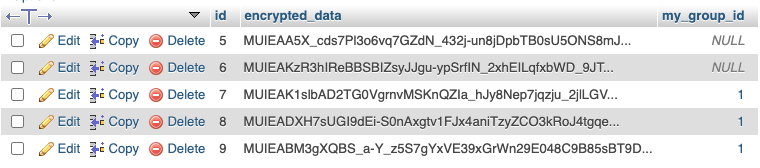

# POC Encrypt DB

POC de chiffrement de colonnes en base

## Halite

Utilisation du bundle Halite pour chiffrer/déchiffrer les données.

https://github.com/paragonie/halite

> Halite is a high-level cryptography interface that relies on libsodium for all of its underlying cryptography operations.

https://github.com/paragonie/halite/blob/master/doc/Classes/Symmetric/Crypto.md

## Création custom type doctrine `EncryptedType`

Gère la conversion entre les données de l'entité et les données stockées en base

```yaml
doctrine:
    dbal:
        types:
            encrypted: App\Doctrine\EncryptedType
``` 

```php
class EncryptedType extends Type
{
    // nom du type
    const TYPE = 'encrypted';

    // Type de donnée en base (VARCHAR)
    public function getSQLDeclaration();
    
    // Converti les données en claire (PHP) en données chiffrées (DB) 
    public function convertToPHPValue();

    // Converti les données données chiffrées (DB) en données en claire (PHP)
    public function convertToDatabaseValue();
}
```

## Crypter

Chiffre et déchiffre des données avec une clé (à ne pas perdre !)

```yaml
services:
    App\Service\CrypterService:
        arguments:
            $pathToEncryptionKey: '%kernel.project_dir%/var/keys/encryption.key'

        # Petit hack pour utiliser le service dans le doctrine custom type :
        # On le fait passer pour un doctrine event listener
        # Sinon il n'est pas injectable (le constructeur du type est final)
        tags:
            - {name: doctrine.event_listener, event: crypter}
```

## Utilisation

- `https://127.0.0.1:8000/key` : génère et stocke une clé (écrase l'éventuelle clé déjà présente) 
- `https://127.0.0.1:8000/test` : créer une entité et la persiste
- `https://127.0.0.1:8000/test2` : créer plusieurs entités liées et les persiste
- `https://127.0.0.1:8000/fetch` : récupère (et déchiffre) les entitées en base

## Données en bases chiffrées

